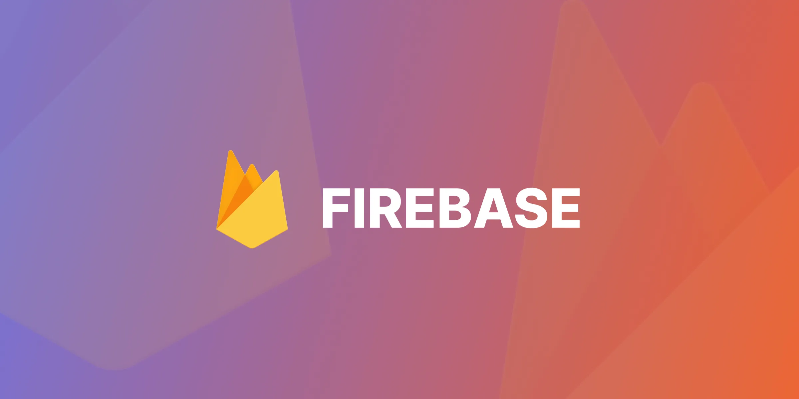

# 🔥 Series Học Firebase + JavaScript

- **Author: @Vinhdev04**
  
  Chào mừng bạn đến với series học **Firebase kết hợp JavaScript** – nơi bạn sẽ được hướng dẫn từ cơ bản đến nâng cao cách xây dựng ứng dụng web sử dụng sức mạnh của nền tảng Firebase và JavaScript thuần.

---

## 🚀 Mục tiêu

- Hiểu rõ Firebase và các dịch vụ cốt lõi như Authentication, Firestore, Hosting, Storage,...
- Nắm vững cách tích hợp Firebase vào project JavaScript (vanilla JS).
- Tự xây dựng các ứng dụng thực tế như To-Do App, Chat App, Auth App,...

---

## 📚 Nội dung các phần học

| STT | Chủ đề                     | Mô tả                                         |
| --- | -------------------------- | --------------------------------------------- |
| 01  | Giới thiệu Firebase        | Tổng quan nền tảng Firebase và cách sử dụng   |
| 02  | Cài đặt Firebase cho Web   | Tạo project, cấu hình Firebase vào HTML + JS  |
| 03  | Firebase Authentication    | Đăng ký, đăng nhập, quản lý người dùng        |
| 04  | Firestore Database         | Thêm, đọc, sửa, xóa dữ liệu realtime          |
| 05  | Firebase Hosting           | Triển khai ứng dụng JS lên Firebase Hosting   |
| 06  | Firebase Storage           | Upload và quản lý file hình ảnh, tài liệu     |
| 07  | Bảo mật và Rules           | Cấu hình bảo mật cho Auth và Database         |
| 08  | Project #1: To-Do App      | App quản lý công việc dùng Firestore          |
| 09  | Project #2: Auth + Profile | App đăng nhập, chỉnh sửa profile người dùng   |
| 10  | Project #3: Chat Realtime  | Ứng dụng trò chuyện đơn giản sử dụng Firebase |

| --- | -------------------------- | --------------------------------------------- |

## 🛠️ Công nghệ sử dụng

- HTML5, CSS3, JavaScript ES6+
- Firebase SDK (v9+ modular syntax)
- Firebase Console
- Git, GitHub

---

## 📁 Cấu trúc repo mẫu

---

## ✨ Yêu cầu

- Biết HTML/CSS cơ bản và JavaScript ES6
- Có tài khoản Google để sử dụng Firebase Console
- Biết sử dụng VSCode và Chrome DevTools

---

## 📌 Ghi chú

- Mỗi phần đều có ví dụ thực hành và hướng dẫn chi tiết.
- Dự án mẫu có sẵn file `index.html`, `main.js` và hướng dẫn triển khai.
- Bạn nên clone repo về để học song song và tự phát triển thêm.

---

## 📬 Liên hệ & Đóng góp

Nếu bạn gặp lỗi hoặc có đóng góp, vui lòng mở [Issue](https://github.com/your-repo/issues) hoặc gửi [Pull Request](https://github.com/your-repo/pulls).

---

> 🚧 **Series đang trong quá trình hoàn thiện - hãy theo dõi để nhận cập nhật mới nhất!**
